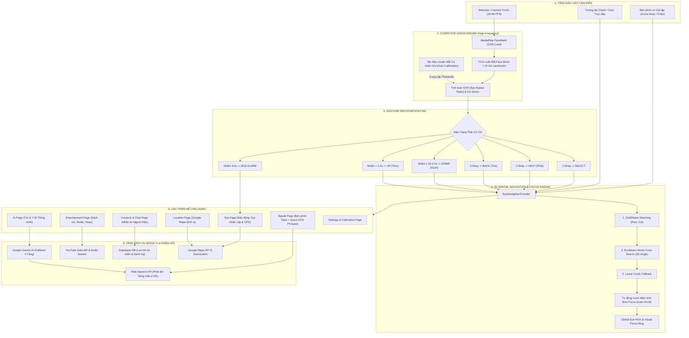
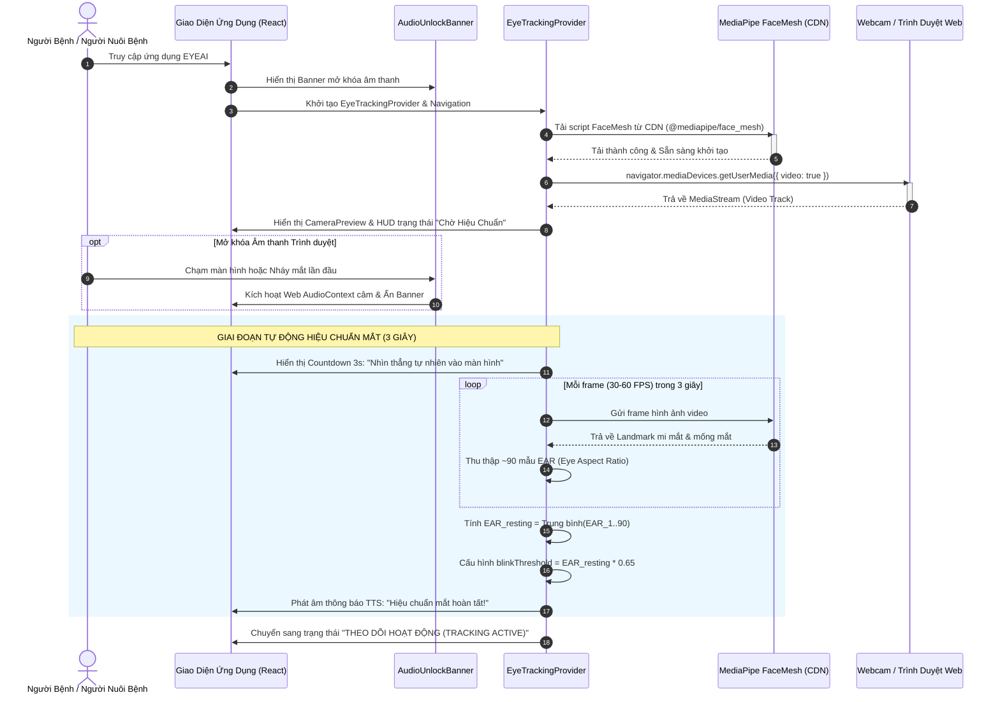
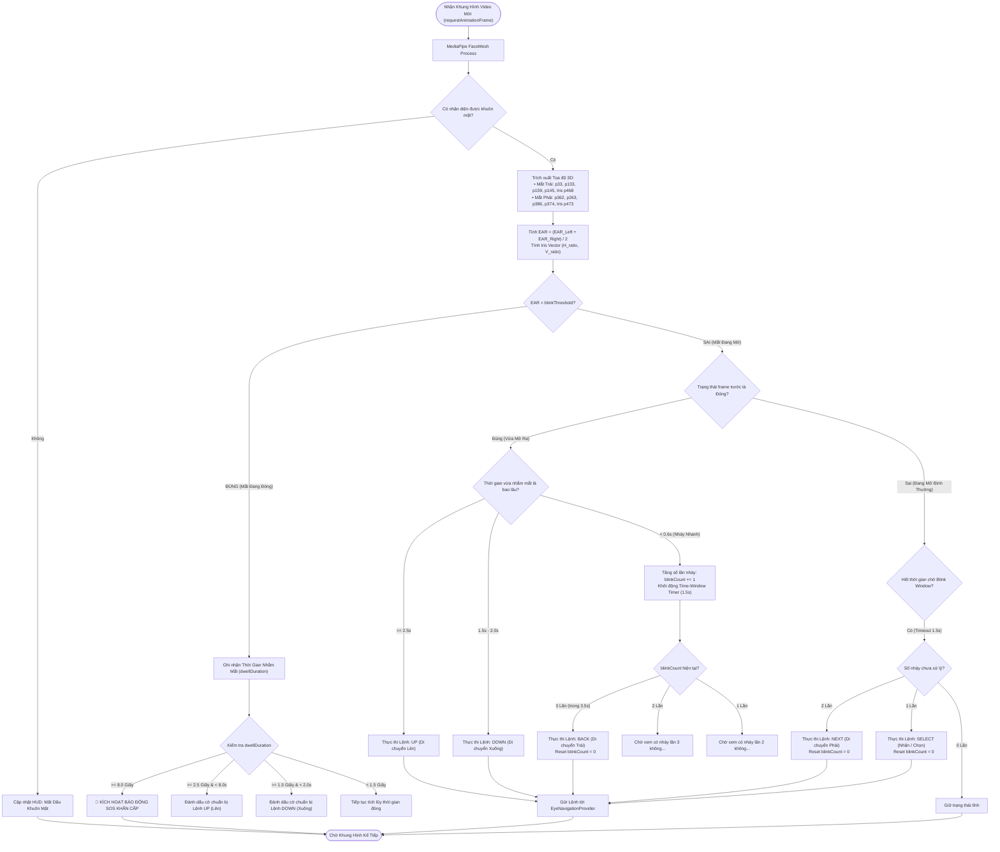
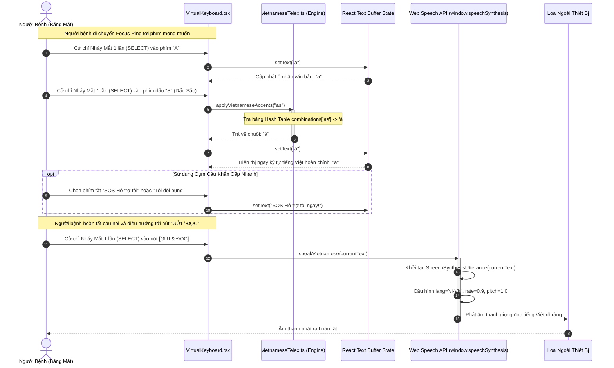
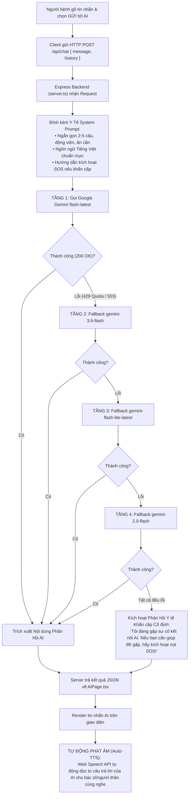
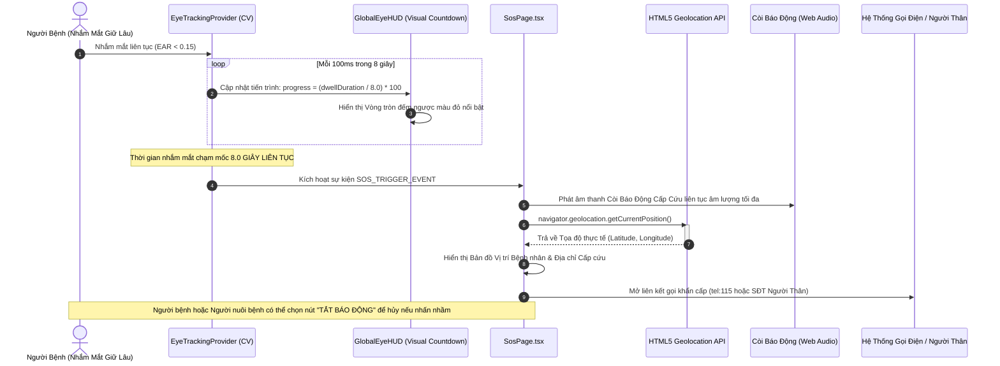
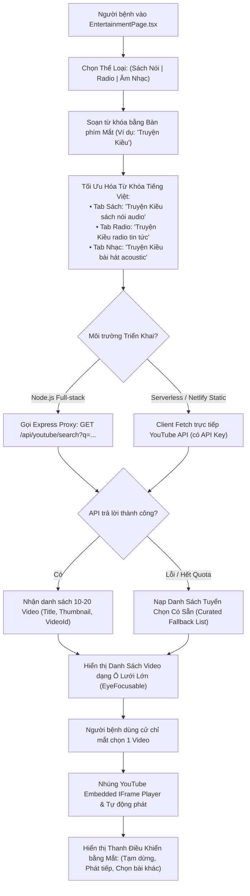
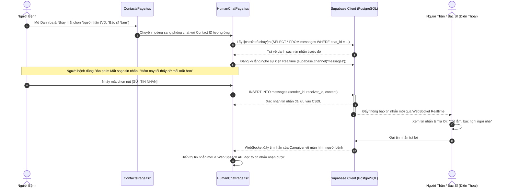
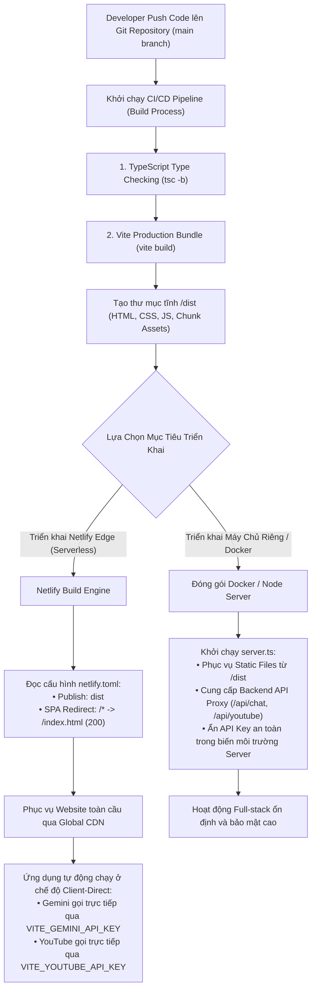

# QUY TRÌNH HOẠT ĐỘNG & WORKFLOW CHI TIẾT HỆ THỐNG EYEAI (EYETALK ASSISTANT)

> **Dự án**: EYEAI (EyeTalk Assistant) - Nền tảng giao tiếp thông minh & hỗ trợ y tế bằng cử chỉ mắt và Trợ lý AI  
> **Phiên bản tài liệu**: 2.0 (Tháng 8, 2026)  
> **Định dạng**: Markdown & Sơ đồ luồng Mermaid chuẩn hóa  

---

## MỤC LỤC TỔNG QUAN CÁC WORKFLOW

1. [Sơ Đồ Workflow Tổng Thể Hệ Thống (End-to-End System Workflow)](#1-sơ-đồ-workflow-tổng-thể-hệ-thống)
2. [Workflow 1: Khởi Tạo Ứng Dụng, Video Stream & Hiệu Chuẩn Mắt Tự Động](#2-workflow-1-khởi-tạo-ứng-dụng-video-stream--hiệu-chuẩn-mắt-tự-động)
3. [Workflow 2: Thị Giác Máy Tính & Máy Trạng Thái Cử Chỉ Mắt (Vision & Gesture FSM)](#3-workflow-2-thị-giác-máy-tính--máy-trạng-thái-cử-chỉ-mắt-vision--gesture-fsm)
4. [Workflow 3: Điều Hướng Không Gian 2D & Tự Động Cuộn Focus (2D Spatial Navigation Engine)](#4-workflow-3-điều-hướng-không-gian-2d--tự-động-cuộn-focus-2d-spatial-navigation-engine)
5. [Workflow 4: Soạn Thảo Văn Bản Telex & Chuyển Đổi Giọng Nói (Virtual Keyboard & TTS)](#5-workflow-4-soạn-thảo-văn-bản-telex--chuyển-đổi-giọng-nói-virtual-keyboard--tts)
6. [Workflow 5: Trò Chuyện Trợ Lý AI Y Tế & Cơ Chế Dự Phòng 4 Tầng (Gemini AI Fallback Pipeline)](#6-workflow-5-trò-chuyện-trợ-lý-ai-y-tế--cơ-chế-dự-phòng-4-tầng-gemini-ai-fallback-pipeline)
7. [Workflow 6: Phát Hiện Nguy Cấp & Kích Hoạt Cấp Cứu SOS 8 Giây](#7-workflow-6-phát-hiện-nguy-cấp--kích-hoạt-cấp-cứu-sos-8-giây)
8. [Workflow 7: Tìm Kiếm & Phát Giải Trí Đa Phương Tiện (YouTube Entertainment Stream)](#8-workflow-7-tìm-kiếm--phát-giải-trí-đa-phương-tiện-youtube-entertainment-stream)
9. [Workflow 8: Quản Lý Danh Bạ & Nhắn Tin Người - Người (Realtime Chat & Supabase Sync)](#9-workflow-8-quản-lý-danh-bạ--nhắn-tin-người---người-realtime-chat--supabase-sync)
10. [Workflow 9: Quy Trình Đóng Gói, Triển Khai & Build CI/CD (Deployment & Edge Fallback)](#10-workflow-9-quy-trình-đóng-gói-triển-khai--build-cicd-deployment--edge-fallback)

---

## 1. SƠ ĐỒ WORKFLOW TỔNG THỂ HỆ THỐNG

Sơ đồ thể hiện luồng dữ liệu liên tục từ khi Camera ghi nhận hình ảnh khuôn mặt người bệnh, qua các tầng xử lý thị giác, điều phối tương tác, đến các dịch vụ bên ngoài và phản hồi âm thanh.

---

## 2. WORKFLOW 1: KHỞI TẠO ỨNG DỤNG, VIDEO STREAM & HIỆU CHUẨN MẮT TỰ ĐỘNG

Quy trình kích hoạt hệ thống khi người dùng mở trang web, xin quyền webcam, nạp mô hình trí tuệ nhân tạo thị giác từ CDN và thu thập trạng thái nhìn tự nhiên để cá nhân hóa tham số nhận diện.

---

## 3. WORKFLOW 2: THỊ GIÁC MÁY TÍNH & MÁY TRẠNG THÁI CỬ CHỈ MẮT (VISION & GESTURE FSM)

Quy trình giải mã hình thái mắt theo từng khung hình và phân loại hành vi nháy mắt / giữ mắt bằng Cỗ máy Trạng thái Hữu hạn (Finite State Machine).

---

## 4. WORKFLOW 3: ĐIỀU HƯỚNG KHÔNG GIAN 2D & TỰ ĐỘNG CUỘN FOCUS (2D SPATIAL NAVIGATION ENGINE)

Quy trình quản lý danh sách các phần tử tương tác (`EyeFocusable`), tính toán hình học 2D không gian để di chuyển Focus Ring chính xác theo cử chỉ mắt và tự động cuộn màn hình.

```mermaid
flowchart TD
    RECEIVE_CMD["Nhận Lệnh Điều Hướng: (NEXT | BACK | UP | DOWN | SELECT)"] --> CHECK_CMD_TYPE{"Lệnh là gì?"}

    %% Nhánh SELECT
    CHECK_CMD_TYPE -- "SELECT" --> GET_CURRENT["Lấy phần tử đang có Focus hiện tại"]
    GET_CURRENT --> HAS_ACTION{"Có onSelect() hoặc onClick()?"}
    HAS_ACTION -- Có --> EXEC_ACTION["Kích hoạt Handler phần tử
    (Chuyển trang / Gõ chữ / Bật tính năng)"]
    HAS_ACTION -- Không --> NOOP["Bỏ qua"]
    EXEC_ACTION --> PLAY_FEEDBACK["Phát âm thanh Click / Đọc nhãn bằng TTS"]

    %% Nhánh Di Chuyển Không Gian
    CHECK_CMD_TYPE -- "NEXT / BACK / UP / DOWN" --> STEP1["BƯỚC 1: Kiểm Tra Ma Trận Nhóm (Grid / Matrix Matching)"]
    STEP1 --> HAS_GRID{"Phần tử có thuộc tính (row, col)?"}
    
    HAS_GRID -- Có --> FIND_GRID_NEIGHBOR["Tìm phần tử lân cận trong cùng Group:
    • NEXT: cùng row, col = col + 1
    • BACK: cùng row, col = col - 1
    • DOWN: row = row + 1, col tương đương
    • UP: row = row - 1, col tương đương"]
    FIND_GRID_NEIGHBOR --> FOUND_GRID{"Tìm thấy phần tử ô lưới?"}
    FOUND_GRID -- Có --> SET_NEW_FOCUS["Thiết lập Focus mới: setFocusedId(candidate.id)"]

    %% Bước 2: Nón không gian 2D
    HAS_GRID -- Không --> STEP2["BƯỚC 2: Tính Toán Nón Vector Không Gian 2D (Spatial Cone Search)"]
    FOUND_GRID -- Không --> STEP2
    
    STEP2 --> CALC_BOUNDS["Lấy Bounding Box getBoundingClientRect()
    Tính tâm hiện tại C1(x1, y1) và các tâm ứng viên C2(x2, y2)
    Tính dx = x2 - x1, dy = y2 - y1"]
    
    CALC_BOUNDS --> FILTER_CONE["Lọc ứng viên trong Nón Hướng Hợp Lệ:
    • NEXT: dx > 20 và |dy| <= 1.5 * |dx|
    • BACK: dx < -20 và |dy| <= 1.5 * |dx|
    • DOWN: dy > 20 và |dx| <= 1.5 * |dy|
    • UP: dy < -20 và |dx| <= 1.5 * |dy|"]
    
    FILTER_CONE --> FIND_MIN_DIST["Tìm ứng viên có khoảng cách Euclidean nhỏ nhất:
    min(sqrt(dx^2 + dy^2))"]
    
    FIND_MIN_DIST --> FOUND_CONE{"Tìm thấy ứng viên trong nón?"}
    FOUND_CONE -- Có --> SET_NEW_FOCUS

    %% Bước 3: Dự phòng mảng 1D tuần hoàn
    FOUND_CONE -- Không --> STEP3["BƯỚC 3: Tuyến Tính Tuần Hoàn (Cyclic 1D Fallback)"]
    STEP3 --> CYCLIC_MOVE["Chuyển sang phần tử kế tiếp / trước đó trong mảng đã đăng ký"]
    CYCLIC_MOVE --> SET_NEW_FOCUS

    %% Tự động cuộn trang và cập nhật UI
    SET_NEW_FOCUS --> AUTO_SCROLL["TỰ ĐỘNG CUỘN FOCUS (eyeFocusAutoScroll.ts)"]
    AUTO_SCROLL --> CHECK_VIEWPORT{"Phần tử có nằm ngoài Viewport?"}
    CHECK_VIEWPORT -- Có --> SMOOTH_SCROLL["window.scrollTo({ top, behavior: 'smooth' })"]
    CHECK_VIEWPORT -- Không --> RENDER_RING["Cập nhật Viền Sáng EyeFocusRing trên màn hình"]
    SMOOTH_SCROLL --> RENDER_RING
```

---

## 5. WORKFLOW 4: SOẠN THẢO VĂN BẢN TELEX & CHUYỂN ĐỔI GIỌNG NÓI (VIRTUAL KEYBOARD & TTS)

Quy trình người bệnh sử dụng cử chỉ mắt để chọn từng ký tự, tự động ghép dấu tiếng Việt Telex và phát âm ra loa thiết bị.

---

## 6. WORKFLOW 5: TRÒ CHUYỆN TRỢ LÝ AI Y TẾ & CƠ CHẾ DỰ PHÒNG 4 TẦNG (GEMINI AI FALLBACK PIPELINE)

Quy trình gửi tin nhắn từ người bệnh tới AI Trợ lý Y tế qua Express Proxy Server với cơ chế chịu lỗi và tự động chuyển đổi mô hình AI dự phòng khi gặp sự cố quota.

---

## 7. WORKFLOW 6: PHÁT HIỆN NGUY CẤP & KÍCH HOẠT CẤP CỨU SOS 8 GIÂY

Quy trình phát hiện khẩn cấp tự động khi người bệnh ngất xỉu, đột quỵ hoặc chủ động nhắm mắt liên tục 8 giây.

---

## 8. WORKFLOW 7: TÌM KIẾM & PHÁT GIẢI TRÍ ĐA PHƯƠNG TIỆN (YOUTUBE ENTERTAINMENT STREAM)

Quy trình tìm kiếm nội dung sách nói, radio, bài hát và điều khiển trình phát video trực tiếp bằng cử chỉ mắt.

---

## 9. WORKFLOW 8: QUẢN LÝ DANH BẠ & NHẮN TIN NGƯỜI - NGƯỜI (REALTIME CHAT & SUPABASE SYNC)

Quy trình chọn người liên hệ, soạn thảo tin nhắn bằng mắt và truyền tải tin nhắn thời gian thực qua cơ sở dữ liệu Supabase.

---

## 10. WORKFLOW 9: QUY TRÌNH ĐÓNG GÓI, TRIỂN KHAI & BUILD CI/CD (DEPLOYMENT & EDGE FALLBACK)

Quy trình biên dịch mã nguồn và chiến lược triển khai linh hoạt trên cả hạ tầng Node.js nguyên bản lẫn nền tảng Edge CDN không máy chủ (Netlify / Vercel).

---

## TỔNG KẾT BẢNG THAM CHIẾU CÁC FILE NGUỒN TƯƠNG ỨNG

| Quy Trình (Workflow) | File Mã Nguồn Chính | Công Nghệ & Thư Viện Sử Dụng |
| :--- | :--- | :--- |
| **Khởi tạo & Hiệu chuẩn Mắt** | [`EyeTrackingProvider.tsx`](file:///c:/Users/Admin/Downloads/eyetalk-assistant/src/modules/eye-control/EyeTrackingProvider.tsx), [`eyeTracker.ts`](file:///c:/Users/Admin/Downloads/eyetalk-assistant/src/modules/eye-control/eyeTracker.ts) | MediaPipe FaceMesh CDN, HTML5 Video |
| **Máy trạng thái cử chỉ (FSM)** | [`EyeTrackingProvider.tsx`](file:///c:/Users/Admin/Downloads/eyetalk-assistant/src/modules/eye-control/EyeTrackingProvider.tsx) | Finite State Machine, EAR Euclidean, Time-Window |
| **Điều hướng không gian 2D** | [`EyeNavigationProvider.tsx`](file:///c:/Users/Admin/Downloads/eyetalk-assistant/src/modules/eye-control/EyeNavigationProvider.tsx), [`eyeFocusAutoScroll.ts`](file:///c:/Users/Admin/Downloads/eyetalk-assistant/src/modules/eye-control/eyeFocusAutoScroll.ts) | Spatial Vector Cone, BoundingBox Rect, DOM Scroll |
| **Soạn thảo Telex & TTS** | [`VirtualKeyboard.tsx`](file:///c:/Users/Admin/Downloads/eyetalk-assistant/src/modules/virtual-keyboard/VirtualKeyboard.tsx), [`vietnameseTelex.ts`](file:///c:/Users/Admin/Downloads/eyetalk-assistant/src/utils/vietnameseTelex.ts) | Telex Accents Hash Map, Web Speech API |
| **Trợ lý AI & Fallback** | [`AiPage.tsx`](file:///c:/Users/Admin/Downloads/eyetalk-assistant/src/pages/AiPage.tsx), [`server.ts`](file:///c:/Users/Admin/Downloads/eyetalk-assistant/server.ts) | Google Gemini SDK (`@google/genai`), Express 4 |
| **Cấp cứu SOS 8 Giây** | [`SosPage.tsx`](file:///c:/Users/Admin/Downloads/eyetalk-assistant/src/pages/SosPage.tsx), [`GlobalEyeHUD.tsx`](file:///c:/Users/Admin/Downloads/eyetalk-assistant/src/components/ui/GlobalEyeHUD.tsx) | Geolocation API, Web Audio Siren, Countdown Timer |
| **Giải trí Đa phương tiện** | [`EntertainmentPage.tsx`](file:///c:/Users/Admin/Downloads/eyetalk-assistant/src/pages/EntertainmentPage.tsx), [`entertainmentService.ts`](file:///c:/Users/Admin/Downloads/eyetalk-assistant/src/services/entertainmentService.ts) | YouTube Data API v3, Embedded IFrame |
| **Danh bạ & Nhắn tin Realtime** | [`HumanChatPage.tsx`](file:///c:/Users/Admin/Downloads/eyetalk-assistant/src/pages/HumanChatPage.tsx), [`ContactsPage.tsx`](file:///c:/Users/Admin/Downloads/eyetalk-assistant/src/pages/ContactsPage.tsx) | Supabase PostgreSQL Client, Realtime Channels |
| **Build & Triển khai** | [`netlify.toml`](file:///c:/Users/Admin/Downloads/eyetalk-assistant/netlify.toml), [`vite.config.ts`](file:///c:/Users/Admin/Downloads/eyetalk-assistant/vite.config.ts), [`package.json`](file:///c:/Users/Admin/Downloads/eyetalk-assistant/package.json) | Vite 6, TailwindCSS v4, Netlify SPA Redirects |

---
*Tài liệu Workflow được biên soạn hoàn chỉnh cho dự án EYEAI.*
